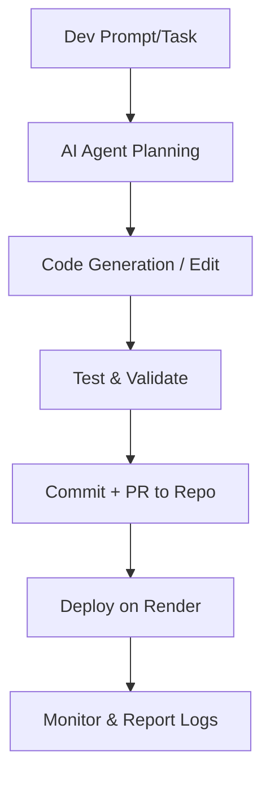

# 🤖 AI Agent for NusaNexus NoFOMO Development

## 🎯 Purpose
AI Agent ini bertugas sebagai **co-developer otomatis** yang membantu tim developer membangun dan memelihara platform trading NoFOMO berbasis Freqtrade, dengan fokus pada efisiensi, keamanan, dan kecepatan.

---

## 🧠 Core Capabilities
1. **Code Generation & Refactoring**
   - Membuat modul backend (FastAPI, Supabase integration, Redis workers).
   - Menulis strategy template (Freqtrade compatible).
   - Menghasilkan script deployment Render (Dockerfile, render.yaml).
   - Otomatis memperbaiki syntax & dependency conflict.

2. **AI Integration**
   - Mengelola prompt untuk Strategy Generator, Optimizer, dan Supervisor.
   - Menyimpan hasil output ke Supabase (tabel `strategies`, `logs`).
   - Memonitor performa strategi dan memberi insight perbaikan.

3. **Project Automation**
   - Membuat branch feature otomatis di repo.
   - Generate dokumentasi Markdown dari kode (docstring parser).
   - Membuat test script otomatis untuk endpoint API.

4. **Validation & Testing**
   - Menjalankan `pytest` untuk backend & bot runner.
   - Validasi hasil trade Freqtrade simulasi.
   - Mengecek permission & security policy Supabase.

5. **Monitoring & Suggestion**
   - Analisa log trade → rekomendasi strategi baru.
   - Deteksi anomaly PnL → beri alert internal dev.
   - Auto-generate changelog per release.

---

## 🧩 Technical Stack Familiarity
- Python (FastAPI, Freqtrade, Redis, Supabase SDK)
- JavaScript/TypeScript (Next.js)
- SQL (Supabase RLS policies)
- Docker, Render CLI, GitHub Actions
- OpenRouter API (LLM model orchestration)

---

## 🧱 Workflow

---

## ⚙️ Agent Rules
- **Always keep Freqtrade core untouched.**
- **Never store or expose API keys in logs.**
- Use `freqtrade backtesting` before suggesting strategy changes.
- Commit messages format:  
  `feat(agent): <feature>` | `fix(agent): <issue>` | `docs(agent): <update>`

---

## 🧾 Example Commands
| Command | Description |
|----------|-------------|
| `/generate_strategy [desc]` | Buat file strategi baru berbasis deskripsi natural |
| `/run_backtest [strategy] [pair]` | Jalankan backtest otomatis |
| `/deploy` | Deploy backend + bot runner ke Render |
| `/update_docs` | Regenerate dokumentasi Markdown |
| `/optimize_params [strategy]` | Jalankan hyperopt untuk strategi tersebut |

---

## 🔒 Security & Ethics
- AI Agent tidak boleh melakukan trading live di akun production tanpa izin eksplisit.
- Semua perubahan langsung diverifikasi melalui GitHub PR & review manusia.
- Data sensitif dienkripsi sebelum disimpan.

---

## 🧭 Long-Term Role
AI Agent akan berkembang menjadi:
- **Continuous AI DevOps Assistant**  
- **Strategy Evolution Engine**  
- **Trading Intelligence Hub**  
yang mempelajari performa strategi nyata dan meningkatkan portofolio otomatis.
